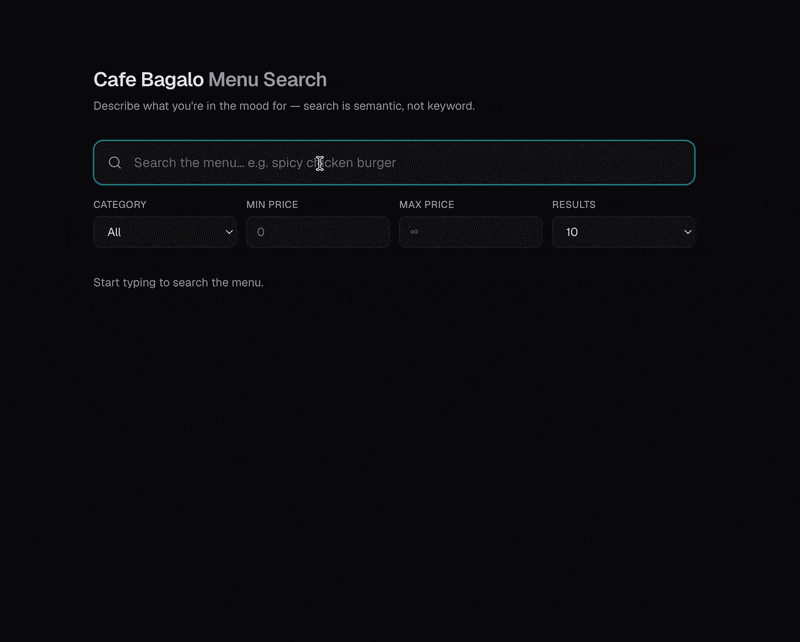

# 🍽️ Restaurant Menu Search — Cafe Bagalo

> Semantic search engine over a real restaurant menu (209 items) powered by **Qdrant**, **Sentence Transformers**, and **FastAPI**.


---

## Overview

A natural-language search API that lets users find menu items by describing what they're in the mood for — rather than searching by exact keywords. Built on a real menu from **Cafe Bagalo** with 209 items across 16 categories (Burgers, BBQ, Pizza, Chinese, Rolls, Deals, and more).

**Example:** Searching *"cheesy burger"* returns Chicken Cheese Burger, Beef Cheese Burger, Zinger Cheese Burger — ranked by semantic relevance.

### Demo



### Features

- 🔍 **Semantic search** — find items by meaning, not exact keywords, using vector embeddings.
- 🎯 **Relevance scoring** — every result carries a cosine-similarity score.
- 🧰 **Rich filtering** — narrow by category and min/max price.
- ⚡ **FastAPI backend** — typed, async, self-documenting at `/docs`.
- 🎨 **Next.js frontend** — dark, minimalist UI with debounced live search.
- 🔒 **Same-origin proxy** — the UI forwards API calls at runtime, so no CORS setup needed.
- 🐳 **Fully Dockerized** — spin up Qdrant + API + UI with a single `docker compose up`.

### How It Works

```
User Query → Sentence Transformer (all-MiniLM-L6-v2) → Vector Embedding
                                                            ↓
                                              Cosine Similarity Search
                                                            ↓
                                                  Qdrant Vector DB → Ranked Results
```

1. **Ingest** — Menu items are loaded from JSON, embedded using `all-MiniLM-L6-v2`, and stored in Qdrant.
2. **Search** — User queries are encoded with the same model and matched via cosine similarity.
3. **Filter** — Results can be narrowed by category, min/max price.

---

## Tech Stack

| Component             | Technology                |
| --------------------- | ------------------------- |
| API Framework         | FastAPI                   |
| Vector Database       | Qdrant                    |
| Embedding Model       | Sentence Transformers     |
| Containerization      | Docker                    |
| Config Management     | Pydantic Settings         |

---

## Project Structure

```
restaurant-menu-search/
├── app/
│   ├── __init__.py
│   ├── config.py          # Settings via env vars (APP_ prefix)
│   ├── ingest.py          # Embed & upsert menu items into Qdrant
│   ├── main.py            # FastAPI app with /search + /categories
│   └── search.py          # Vector search + category listing
├── data/
│   └── menu.json          # Cafe Bagalo menu (209 items)
├── frontend/              # Next.js UI (App Router + Tailwind, dark theme)
│   ├── app/               # layout, page, global styles
│   ├── components/        # SearchBar, Filters, ResultCard, ResultsList
│   ├── lib/               # typed API client + hooks
│   └── Dockerfile
├── scripts/
│   └── run_ingest.py      # CLI entrypoint for ingestion
├── docker-compose.yml     # qdrant + api + web
├── Dockerfile
├── requirements.txt
└── README.md
```

---

## Quick Start

### Prerequisites

- Python 3.12+
- Docker (for Qdrant)

### 1. Start Qdrant

```bash
docker run -d -p 6333:6333 -p 6334:6334 qdrant/qdrant
```

### 2. Install Dependencies

```bash
python -m venv .venv && source .venv/bin/activate
pip install -r requirements.txt
```

### 3. Ingest the Menu

```bash
python -m scripts.run_ingest
```

### 4. Run the API

```bash
uvicorn app.main:app --reload
```

The API is now live at `http://localhost:8000` — interactive docs at [`/docs`](http://localhost:8000/docs).

### 5. Run the Frontend (optional)

```bash
cd frontend
npm install
npm run dev
```

The UI is live at `http://localhost:3000`. By default the browser talks to the UI's own `/api` route, which proxies to the backend (same-origin — no CORS). The proxy target is set by `API_INTERNAL_URL` (defaults to `http://localhost:8000`, read at runtime); configure both in `frontend/.env.local`.

---

## API Usage

### Endpoints

| Method | Endpoint      | Description                                  |
| ------ | ------------- | -------------------------------------------- |
| `GET`  | `/health`     | Liveness probe — returns `{"status": "ok"}`  |
| `GET`  | `/categories` | Distinct menu categories (for the UI filter) |
| `GET`  | `/search`     | Semantic search with optional filters        |

Interactive Swagger docs are available at [`/docs`](http://localhost:8000/docs).

### `GET /search`

| Parameter    | Type     | Default | Description                  |
| ------------ | -------- | ------- | ---------------------------- |
| `q`          | `string` | —       | Natural language search query |
| `limit`      | `int`    | `5`     | Max results (1–50)           |
| `category`   | `string` | `null`  | Filter by category           |
| `min_price`  | `float`  | `null`  | Minimum price filter         |
| `max_price`  | `float`  | `null`  | Maximum price filter         |

### Examples

```bash
# Semantic search
curl "http://localhost:8000/search?q=spicy+chicken"

# Filter by category
curl "http://localhost:8000/search?q=cheesy&category=Pizza"

# Price range (PKR)
curl "http://localhost:8000/search?q=beef+bbq&max_price=600"

# Find deals for a group
curl "http://localhost:8000/search?q=family+deal&category=Deals"
```

### `GET /categories`

Returns the distinct menu categories (used to populate the UI filter dropdown).

```bash
curl "http://localhost:8000/categories"
```

### Sample Response

```json
{
  "query": "spicy chicken",
  "count": 3,
  "results": [
    {
      "id": 5,
      "score": 0.68,
      "name": "Zinger Spicy Burger",
      "category": "Fast Food Burgers",
      "price": 450,
      "tags": ["chicken", "zinger", "spicy", "burger"]
    }
  ]
}
```

---

## Docker

Run the full stack (Qdrant + API + Next.js UI) with Compose:

```bash
docker compose up --build
```

- UI → `http://localhost:3000`
- API → `http://localhost:8000`

> The UI proxies API calls through its own `/api` route (`API_INTERNAL_URL=http://api:8000`), so no CORS config or build-time API URL is needed.

Or build just the API image:

```bash
docker build -t restaurant-menu-search .
docker run -e APP_QDRANT_HOST=host.docker.internal -p 8000:8000 restaurant-menu-search
```

---

## Configuration

All settings are overridable via environment variables with the `APP_` prefix:

| Variable              | Default            | Description              |
| --------------------- | ------------------ | ------------------------ |
| `APP_QDRANT_HOST`     | `localhost`        | Qdrant server host       |
| `APP_QDRANT_PORT`     | `6333`             | Qdrant server port       |
| `APP_COLLECTION_NAME` | `menu_items`       | Qdrant collection name   |
| `APP_EMBEDDING_MODEL` | `all-MiniLM-L6-v2` | Sentence Transformer model |
| `APP_MENU_PATH`       | `data/menu.json`   | Path to menu data        |
| `APP_CORS_ORIGINS`    | `*`                | Comma-separated allowed frontend origins |

The frontend reads two variables (in `frontend/.env.local`):

| Variable              | Default                 | Description                                            |
| --------------------- | ----------------------- | ------------------------------------------------------ |
| `NEXT_PUBLIC_API_URL` | `/api`                  | Browser-facing API base; `/api` uses the built-in proxy (baked at build time) |
| `API_INTERNAL_URL`    | `http://localhost:8000` | Server-side target the `/api` proxy forwards to (runtime) |

---

## License

This project is licensed under the MIT License.